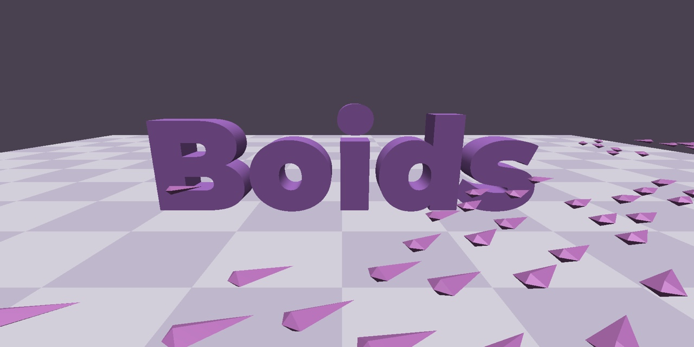

## Boids.kt 

A 3D Boids simulation implementation with Kotlin/JS
 
Inspired by [Flocks, Herds, and Schools: A Distributed Behavioral Model](https://team.inria.fr/imagine/files/2014/10/flocks-hers-and-schools.pdf) by Craig Reynolds

 
 
Early work in progress but all the basic steering behaviors (separation, cohesion, alignment) and basic collision avoidance have already been implemented

See it live [here](http://gonnen.com/boids.kt/) 

If you want to get started with 3D graphics using Kotlin JS and three.js, take a look at my [kotlin-three-js-starter](https://github.com/liorgonnen/kotlin-three-js-starter) project
